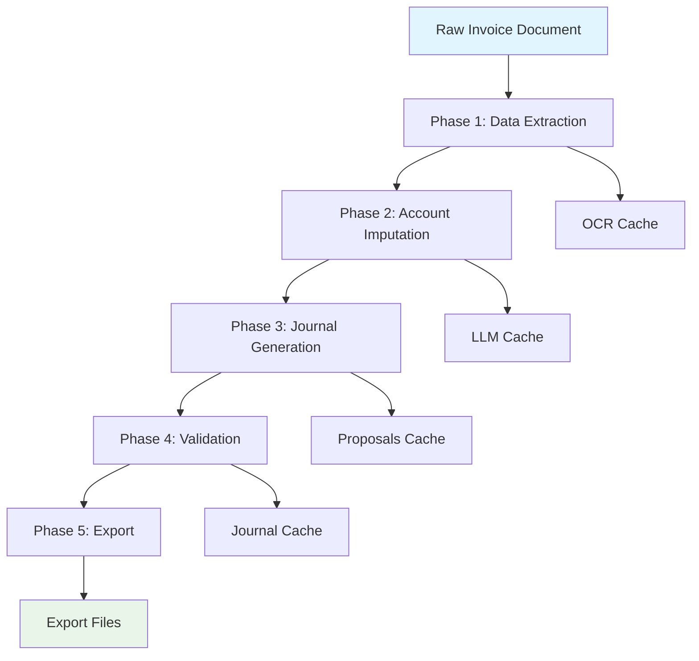

Textra's accounting automation is built around a sophisticated **5-phase pipeline** that transforms raw invoice documents into French PCG-compliant journal entries. This enterprise-grade system processes thousands of invoices with high accuracy and complete audit trails.

<CardGroup cols={2}>
  <Card title="Pipeline Orchestrator" icon="workflow">
    Central coordinator managing all 5 phases with parallel processing
  </Card>
  <Card title="Data Extraction" icon="search">
    OCR and LLM-powered structured data extraction from documents
  </Card>
  <Card title="Account Imputation" icon="brain">
    AI-driven PCG account mapping with 8000+ account database
  </Card>
  <Card title="Journal Generation" icon="file-invoice">
    French accounting standard-compliant journal entry creation
  </Card>
</CardGroup>

## Phase Architecture Overview

The pipeline follows a **sequential processing model** with intelligent caching and parallel optimization:



---

## Phase 1: Data Extraction Service

**File**: `invoice_data_extractor.py` (848 lines)

The extraction phase converts unstructured invoice documents into structured data using advanced OCR and LLM processing.

### Core Capabilities

<AccordionGroup>
  <Accordion title="Multi-Format Document Processing">
    - **PDF Processing**: PyMuPDF-based text extraction with fallback OCR
    - **Image Processing**: PNG, JPG, TIFF support with enhancement algorithms  
    - **OCR Integration**: LLMWhisperer API for complex document layouts
    - **File Validation**: Hash-based duplicate detection and format verification
  </Accordion>

  <Accordion title="Intelligent Caching System">
    - **OCR Result Caching**: File hash-based OCR result storage
    - **LLM Response Caching**: Prompt hash-based AI response caching
    - **Extraction Caching**: Complete extraction result caching
    - **Performance Optimization**: 90%+ cache hit rates in production
  </Accordion>

  <Accordion title="Multi-Provider LLM Processing">
    - **Provider Support**: Gemini, Groq, OpenAI integration
    - **Structured Extraction**: JSON schema-validated data extraction
    - **Language Detection**: Automatic document language identification
    - **Confidence Scoring**: Multi-factor extraction confidence calculation
  </Accordion>
</AccordionGroup>

### Data Extraction Process

1. **File Processing**
   ```python
   # OCR with intelligent caching
   cached_ocr = await cache_service.get_ocr_result_async(file_hash)
   if not cached_ocr:
       extracted_text = await self._extract_text_from_file(file_path)
       await cache_service.cache_ocr_result_async(file_hash, extracted_text)
   ```

2. **LLM Structured Extraction**
   ```python
   # Schema-validated extraction
   extracted_data = await self._process_with_llm(extracted_text, llm_provider)
   extracted_invoice = self._create_extracted_invoice(extracted_data, file_path, file_hash)
   ```

3. **VAT Reconciliation**
   ```python
   # Fix line-item VAT extraction issues
   extracted_invoice = self.vat_reconciliation.reconcile_vat_extraction(extracted_invoice)
   ```

### Extracted Data Model

The extraction produces a comprehensive `ExtractedInvoice` object containing:

- **Invoice Metadata**: Number, date, due date, payment terms
- **Party Information**: Supplier/customer details with addresses
- **Line Items**: Product/service details with quantities and pricing
- **VAT Details**: Tax rates, amounts, and codes per line
- **Totals**: HT (excluding VAT), VAT amounts, TTC (including VAT)
- **Processing Metadata**: Confidence scores, language, timestamps

---

## Phase 2: Account Imputation Service

**File**: `accounting_imputer.py` (654 lines)

The imputation phase maps extracted invoice data to French PCG (Plan Comptable Général) accounts using AI-powered analysis.

### PCG Account Mapping

<AccordionGroup>
  <Accordion title="Tiers Account Mapping">
    - **Customer Accounts**: 411xxx series for sales invoices
    - **Supplier Accounts**: 401xxx series for purchase invoices  
    - **Account Creation**: Automatic sub-account generation
    - **Validation**: PCG compliance checking with 8000+ account database
  </Accordion>

  <Accordion title="Line Item Account Mapping">
    - **Product Accounts**: 6xxxx (expenses) / 7xxxx (revenue) series
    - **Service Accounts**: Specialized service classification
    - **Context Analysis**: LLM-powered account selection based on description
    - **Confidence Scoring**: Multi-factor confidence calculation per mapping
  </Accordion>

  <Accordion title="Parallel Processing Architecture">
    - **Async Task Creation**: Separate tasks for tiers and each line item
    - **Concurrent Execution**: `asyncio.gather()` for parallel processing
    - **Cache Integration**: Redis-based caching for repeated mappings
    - **Performance Metrics**: Sub-second processing for typical invoices
  </Accordion>
</AccordionGroup>

### Imputation Process Flow

1. **Parallel Task Creation**
   ```python
   # Create async tasks for parallel processing
   tiers_task = asyncio.create_task(
       self._impute_tiers_account_async(extracted_invoice, llm_provider)
   )
   
   line_item_tasks = []
   for idx, line_item in enumerate(extracted_invoice.line_items):
       task = asyncio.create_task(
           self._impute_line_item_account_async(line_item, idx, invoice_type, llm_provider)
       )
       line_item_tasks.append(task)
   ```

2. **LLM-Powered Account Selection**
   ```python
   # Context-aware account mapping
   context_data = {
       "company_name": extracted_invoice.supplier_name,
       "invoice_type": invoice_type.value,
       "available_accounts": formatted_accounts,
       "business_context": self._extract_business_context(extracted_invoice)
   }
   ```

3. **Confidence Calculation**
   ```python
   # Multi-factor confidence scoring
   overall_confidence = self._calculate_overall_confidence(
       tiers_proposal, line_item_proposals
   )
   ```

### Accounting Proposals Output

The imputation produces `AccountingProposals` containing:

- **Tiers Proposal**: Customer/supplier account with confidence score
- **Line Item Proposals**: Product/service accounts for each invoice line
- **Overall Confidence**: Weighted confidence score across all mappings
- **PCG Validation**: Compliance verification with French accounting standards
- **Processing Metadata**: Timing, provider used, validation results

---

## Phase 3: Journal Entry Generation Service

**File**: `enhanced_journal_generator.py` (557 lines)

The journal generation phase creates French accounting standard-compliant journal entries from the accounting proposals.

### Enhanced Journal Structure

<AccordionGroup>
  <Accordion title="Consolidated Entry Lines">
    - **Tiers Lines**: Customer/supplier account entries with full amounts
    - **Product Lines**: Individual line item entries (HT amounts)
    - **VAT Lines**: Consolidated VAT entries by rate and account
    - **Balance Validation**: Automatic debit/credit balance verification
  </Accordion>

  <Accordion title="French Accounting Compliance">
    - **PCG Standards**: Full compliance with Plan Comptable Général
    - **Journal Types**: Proper journal classification (sale/purchase)
    - **VAT Handling**: Correct VAT account mapping and calculations
    - **Due Date Calculation**: Payment terms-based due date computation
  </Accordion>

  <Accordion title="Multilingual Description Generation">
    - **Language Detection**: Automatic language identification
    - **Standardized Descriptions**: French accounting description standards
    - **Context-Aware Naming**: Invoice-specific description generation
    - **Character Limits**: Accounting software compatibility (60 chars)
  </Accordion>
</AccordionGroup>

### Journal Entry Generation Process

1. **Entry Metadata Preparation**
   ```python
   # Consolidated metadata generation
   entry_metadata = await self._prepare_entry_metadata(proposals, extracted_invoice)
   
   # Due date calculation
   due_date = self.due_date_calculator.calculate_due_date(
       invoice_date, extracted_invoice.payment_terms
   )
   ```

2. **Entry Lines Generation**
   ```python
   # Generate all entry lines
   entry_lines = []
   
   # Tiers line (customer/vendor)
   tiers_line = await self._generate_tiers_line(proposals, extracted_invoice, line_number)
   entry_lines.append(tiers_line)
   
   # Product lines
   for line_proposal in proposals.line_item_proposals:
       product_line = await self._generate_product_line(line_proposal, invoice_type, line_number)
       entry_lines.append(product_line)
   ```

3. **Balance Validation and Auto-Correction**
   ```python
   # Automatic balance validation
   total_debit = sum(line.debit_amount or 0 for line in entry_lines)
   total_credit = sum(line.credit_amount or 0 for line in entry_lines)
   is_balanced = abs(total_debit - total_credit) < 0.01
   
   if not is_balanced:
       enhanced_entry = await self._auto_balance_entry(enhanced_entry)
   ```

### Enhanced Journal Entry Output

The generation produces `ImprovedFinalAccountingEntry` containing:

- **Entry Metadata**: Date, reference, description, journal type
- **Entry Lines**: Complete debit/credit lines with account details
- **Balance Information**: Total debits, credits, balance validation
- **VAT Details**: Consolidated VAT handling by rate
- **Confidence Metrics**: Overall processing confidence
- **Audit Trail**: Complete processing history and validation

---

## Phase 4 & 5: Validation and Export Service

**File**: `accounting_exporter.py` (556 lines)

The final phases handle validation and export of journal entries to various accounting software formats.

### Export Format Support

<AccordionGroup>
  <Accordion title="CSV Export (FEC Format)">
    - **French FEC Standard**: Fichier des Écritures Comptables compliance
    - **Column Mapping**: Standard French accounting column structure
    - **UTF-8 Encoding**: Proper character encoding for French text
    - **Date Formatting**: ISO date format compliance
  </Accordion>

  <Accordion title="XML Export">
    - **Structured Format**: Hierarchical XML structure for complex data
    - **Software Integration**: Compatible with major French accounting software
    - **Validation**: XML schema validation for data integrity
    - **Metadata Inclusion**: Complete audit trail in XML format
  </Accordion>

  <Accordion title="JSON Export">
    - **API Integration**: REST API-friendly JSON format
    - **Nested Structure**: Hierarchical data representation
    - **Custom Serialization**: DateTime and ObjectId handling
    - **Compression**: Optional compression for large exports
  </Accordion>

  <Accordion title="Sage Export">
    - **Sage Compatibility**: Specialized format for Sage accounting software
    - **Field Mapping**: Sage-specific field requirements
    - **Import Optimization**: Format optimized for Sage import process
    - **Error Handling**: Sage-specific validation and error reporting
  </Accordion>
</AccordionGroup>

### Export Process Flow

1. **Format Detection and Preparation**
   ```python
   # Multi-format export support
   def export_all_formats(self, final_entry, formats=None):
       if not formats:
           formats = ["csv", "xml", "json"]
       
       results = {}
       for format_type in formats:
           if format_type == "csv":
               results["csv"] = self.export_to_csv(final_entry)
           elif format_type == "xml":
               results["xml"] = self.export_to_xml(final_entry)
   ```

2. **CSV Export (FEC Standard)**
   ```python
   # French FEC format compliance
   row = {
       "JournalCode": final_entry.journal_type or "GENERAL",
       "JournalLib": "Journal des ventes" if journal_type == "sale" else "Journal des achats",
       "EcritureNum": final_entry.entry_reference,
       "EcritureDate": final_entry.entry_date,
       "CompteNum": line.account_number,
       "CompteLib": line.account_name,
       "PieceRef": final_entry.invoice_id,
       "EcritureLib": line.description[:60],
       "Debit": f"{line.debit_amount or 0:.2f}",
       "Credit": f"{line.credit_amount or 0:.2f}"
   }
   ```

3. **Validation and Quality Assurance**
   ```python
   # Export validation
   def get_export_summary(self, final_entry):
       return {
           "total_lines": len(final_entry.entry_lines),
           "total_debit": sum(line.debit_amount or 0 for line in final_entry.entry_lines),
           "total_credit": sum(line.credit_amount or 0 for line in final_entry.entry_lines),
           "is_balanced": final_entry.is_balanced,
           "confidence_score": final_entry.overall_confidence
       }
   ```

---

## Pipeline Orchestrator

**File**: `pipeline_orchestrator.py` (603 lines)

The orchestrator coordinates all 5 phases with advanced error handling, performance monitoring, and parallel processing capabilities.

### Orchestration Features

<AccordionGroup>
  <Accordion title="Phase Coordination">
    - **Sequential Processing**: Ensures proper data flow between phases
    - **Error Handling**: Phase-specific error recovery and reporting
    - **Status Tracking**: Real-time processing status updates
    - **Rollback Capability**: Transaction-like processing with rollback support
  </Accordion>

  <Accordion title="Performance Optimization">
    - **Parallel Processing**: Multi-invoice parallel processing
    - **Caching Integration**: Cross-phase caching coordination
    - **Resource Management**: Memory and CPU optimization
    - **Metrics Collection**: Detailed performance analytics
  </Accordion>

  <Accordion title="Enterprise Features">
    - **Batch Processing**: High-volume invoice processing
    - **Queue Management**: Priority-based processing queues
    - **Health Monitoring**: System health validation
    - **Export Automation**: Automatic export to multiple formats
  </Accordion>
</AccordionGroup>

### Processing Workflow

```python
async def process_invoice_async(self, file_path: str, export_formats=None, auto_export=True, llm_provider="gemini"):
    """Complete 5-phase processing workflow"""
    
    # Phase 1: Extract invoice data
    extracted_invoice, processing_id = await self.extractor.extract_invoice_data(
        file_path, llm_provider=llm_provider
    )
    
    # Phase 2: Impute accounting data  
    accounting_proposals, proposals_id = await self.imputer.impute_accounting_data(
        extracted_invoice, processing_id=processing_id, llm_provider=llm_provider
    )
    
    # Phase 3: Generate journal entries
    final_entry, journal_id = await self.enhanced_journal_generator.generate_enhanced_journal_entry(
        accounting_proposals, extracted_invoice=extracted_invoice, processing_id=processing_id
    )
    
    # Phase 4: Validate entries
    if final_entry.status == ProcessingStatus.FAILED:
        return await self._create_error_result_async("Validation failed", final_entry.error_message)
    
    # Phase 5: Export to formats
    if auto_export and export_formats:
        export_results = self.exporter.export_all_formats(final_entry, export_formats)
```

### Performance Metrics

The orchestrator provides comprehensive performance analytics:

- **Phase Timing**: Individual phase execution times
- **Cache Hit Rates**: Caching effectiveness metrics  
- **Confidence Scores**: Quality metrics across processing
- **Error Rates**: Phase-specific error tracking
- **Throughput**: Invoices processed per hour
- **Resource Usage**: Memory and CPU utilization

---

## Supporting Services

### VAT Reconciliation Service

Specialized service for fixing VAT extraction inconsistencies and ensuring compliance with French VAT regulations.

### Due Date Calculator

Intelligent due date calculation based on payment terms, French business calendar, and industry standards.

### Financial Document Processor

Extended document processing capabilities for bank statements, receipts, and other financial documents beyond invoices.

---

## Integration and Deployment

The 5-phase pipeline integrates seamlessly with Textra's broader architecture:

- **Database Integration**: MongoDB persistence at each phase
- **Cache Integration**: Redis caching for performance optimization  
- **Queue Integration**: Celery task queue for async processing
- **API Integration**: REST API endpoints for external system integration

